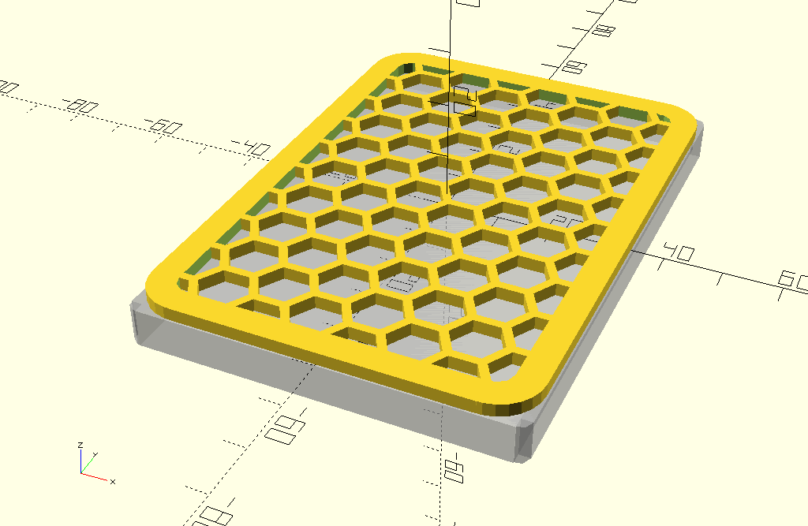

# SSD-Spacer

Spacer to make a 9.5mm SSD from a 7mm SSD.

## Libraries used

- https://github.com/openscad/MCAD
- https://www.thingiverse.com/thing:2484395

## License

**SSD-Spacer** by *Alexander Dahl* is licensed under a
[Creative Commons Attribution-ShareAlike 4.0 International License](http://creativecommons.org/licenses/by-sa/4.0/).

Based on [Honeycomb library (OpenSCAD)](https://www.thingiverse.com/thing:2484395)
by [Gael Lafond](https://www.thingiverse.com/gaellafond/about).
